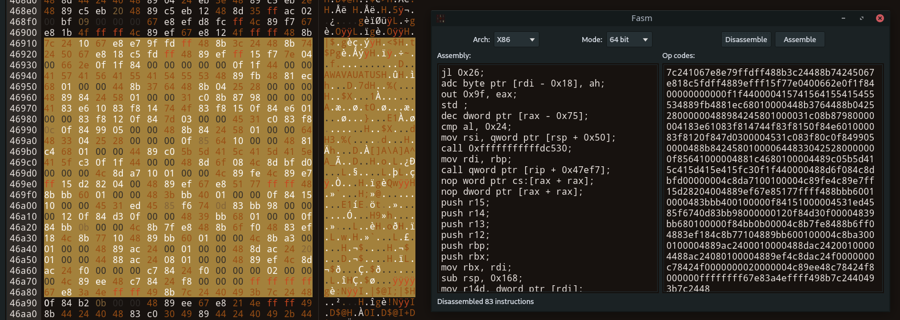

# Fhex - A Full-Featured HexEditor

This project is born with the aim to develop a lightweight, but useful tool. The reason is that the existing hex editors have some different limitations (e.g. too many dependencies, missing hex coloring features, etc.).

 



This project is based on **qhexedit2**, **capstone** and **keystone** engines. New features could be added in the future, PRs are welcomed.

## Features

* Search and replace (UTF-8, HEX, regex, inverse search supported) [`CTRL + F`]
* Colored output (white spaces, ASCII characters, 0xFF, UTF-8 and NULL bytes have different colors)
* Interpret selected bytes as integer, long, unsigned long [`CTRL + B`]
* Copy & Paste  [`CTRL + C` and  `CTRL + V`]
* Copy selected unicode characters [`CTRL + Space`]
* Zeroing all the selected bytes [`CTRL + D`]
* Undo & Redo [`CTRL + Z` and `CTRL + Y`]
* Find & Replace
* Drag & Drop (*Hint:* Drag&Dropping two files the editor will diff them)
* Overwrite the same file or create a new one  [`CTRL + S`]
* Big files supported (**Only on Linux**, Windows has still several limitations on the supported file size)
* Goto offset  [`CTRL + G`]
* Insert mode supported in order to insert new bytes instead to overwrite the existing one [`INS`]
* Create new instances [`CTRL + N`]
* Basic text viewer for the selected text [`CTRL + T`]
* Reload the current file [`F5`]
* Compare two different files at byte level
* Browsable Binary Chart (see later for details) [`F1`]
* Hex - Dec number converter [`F2`]
* Hex String escaper (e.g from 010203 to \x01\x02\x03) [`F3`]
* Pattern Matching Engine (see later for details)
* Disassebler based on Capstone Engine [`F4`]
* Assembler based on Keystone Engine [`F4`]
* Shortcuts for all these features

## Pattern Matching Engine
Fhex can read a configuration file (from `~/fhex/config.json`) in JSON format with a list of regex to highlight and a comment/label to add close to the matches.

Example that highlights urls with a basic regex and emails:
```json
{
    "PatternMatching":
    [
        {
            "regex" : "www.[a-zA-Z0-9].",
            "color" : "rgba(250,200,200,50)",
            "message" : "Found url"
        },
        {
            "regex" : "[A-Z0-9_!#$%&'*+/=?`{|}~^.-]+@[A-Z0-9.-]+",
            "color" : "rgba(250,200,200,50)",
            "message" : "Found email address"
        }
    ]
}
```
To activate pattern matching press `CTRL + P`

## Binary Chart

Fhex has the feature to chart the loaded binary file (*Note:* In order to compile the project, now you need also `qt5-charts` installed on the system).
The y-axis range is between 0 and 255 (in hex 0x0 and 0xff, i.e. the byte values). The x-axis range is between 0 and the filesize.

The chart plots the byte values of the binary file and let you focus only on the relevant sections. For example, if in a binary file there is an area full of null bytes, you can easily detect it from the chart.

### License
GPL-3
